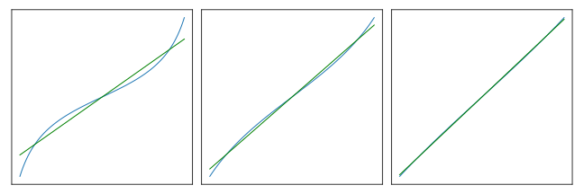

Introduction
============

To fit a line to data in two dimensions is a simple case of a very general problem. NumPy_ and SciPy_ have algorithms that are suited to these general cases, but using them is awkward here. Also, the returned results do not include the commonly used "correlation coefficient".

This package provides a simple interface to these libraries for this usage and also provides a native implementation, so there are no required dependencies.

----

Usage
=====

Backend
-------

By default, the first time ``leastsqs()`` is invoked, a backend is selected. If ``scipy`` is found, it is selected. If not, then ``numpy`` is attempted. If neither are importable, the native backend is used.

To explicitly choose a backend, call the ``set_backend()`` function with a member of the ``Backend`` enumerated type, or the case-insensitive name (``SCIPY``, ``NUMPY``, or ``NATIVE``) of a member. ::

  from leastsqs import leastsqs, set_backend, Backend
  set_backend(Backend.NUMPY)

Equivalently:

::

  set_backend('NUMPY')

::

  set_backend('numpy')

::

  set_backend('NumPy')

The backend can be (re)set as often as desired. Note that the ``leastsqs()`` binding does not change; calls to existing references will observe a successful change.

----

Invoking
--------

::

  (a, b), (rsq, ssr) = leastsqs(xdata, ydata)

- ``xdata``, ``ydata`` are finite iterables of equal length, which may be no less than two. Any type that reasonably resolves to float should be fine, such as Decimals_ or Fractions_.

- ``(a, b)`` are the coefficients to a degree-one polynomial representing the fitted line, with equation ``y = a + b * x``.

- ``rsq``, r-squared, is the correlation coefficient. Consult the links below for details, but a value closer to one represents a better fit.

- ``ssr``, sum of squared residuals, is a more direct expression of the difference between the fitted line and the ydata.

**Sample Session**

To deterministically and with minimal arbitrariness generate sample data, we use the *tan()* function to represent a "noisy" line.

As *xmax*-*xmin* approaches zero, the fitted line will approach the tangent, which has unit slope at the origin.

Three iterations are presented, zooming progressively in to better-fitting ranges. ::

  >>> from math import tan,pi
  >>> from leastsqs import leastsqs

  >>> xmin, xmax, steps = -3*pi/8, 3*pi/8, 100
  >>> xdata=[i/steps*(xmax-xmin)+xmin for i in range(steps+1)]
  >>> ydata=map(tan, xdata)

  >>> leastsqs(xdata,ydata)
  ((-5.523565994647257e-18, 1.4959249411590796), (0.9618751286358497, 4.227385657971317))

  >>> xmin, xmax = -pi/4, pi/4
  >>> xdata=[i/steps*(xmax-xmin)+xmin for i in range(steps+1)]
  >>> ydata=map(tan, xdata)

  >>> leastsqs(xdata,ydata)
  ((9.6662404906327e-18, 1.1541031618268436), (0.9957605179443147, 0.12012328883843057))

  >>> xmin, xmax = -pi/8, pi/8
  >>> xdata=[i/steps*(xmax-xmin)+xmin for i in range(steps+1)]
  >>> ydata=map(tan, xdata)

  >>> leastsqs(xdata,ydata)
  ((1.0615603395962697e-17, 1.0329423548593133), (0.9997962667107732, 0.0011513907061941977))

**From The Shell**

Support for Python's ``-m`` run-as-script switch is included::

  $ python -m leastsqs -h
  usage: __main__.py [-h] [--seed SEED] [--backend BACKEND] [--outfile OUTFILE]
                     [--density DENSITY]
                     coefficients coefficients rsq [steps]

  Given a line and target r-squared, noisy data is generated and a line fit to
  them. A report is printed, and a plot-to-file feature is available.

  positional arguments:
    coefficients          Coefficients a,b of input line y = a+b*x.
    rsq                   Target r-squared. The relative error of the fit's
                          r-squared is reported; To decrease this error, set the
                          target closer to one or increase the number of points.
    steps                 Number of points generated; defaults to 100.

  optional arguments:
    -h, --help            show this help message and exit
    --seed SEED           RNG seed. If convertable to integer, it is. Note that
                          the absolute value is taken of negative integers; n
                          and -n are the same seed.
    --backend BACKEND     Case-insensitive selection from: scipy, numpy, native.

  plotting:
    --outfile OUTFILE, -o OUTFILE
                          Generate plots, and save to this file. Requires
                          Matplotlib. SVG and PNG formats are supported, and
                          selected by the file extension.
    --density DENSITY     Noise density. Proportion of randomly distributed
                          noisy points to plot. Defaults to 1.0.

  The relative error of the r-squared of the fit with repect to the target is
  included in the report. To decrease this error, set the target closer to one
  or increase the number of points.

----

See Also
========

| `"Least Squares Fitting" at Wolfram MathWorld <https://mathworld.wolfram.com/LeastSquaresFitting.html>`_
| `"Correlation Coefficient" at Wolfram MathWorld <https://mathworld.wolfram.com/CorrelationCoefficient.html>`_

.. _NumPy: https://numpy.org/doc/stable/reference/generated/numpy.linalg.lstsq.html#numpy.linalg.lstsq
.. _SciPy: https://docs.scipy.org/doc/scipy/reference/generated/scipy.linalg.lstsq.html#scipy.linalg.lstsq

.. _Decimals: https://docs.python.org/3/library/decimal.html
.. _Fractions: https://docs.python.org/3/library/fractions.html
